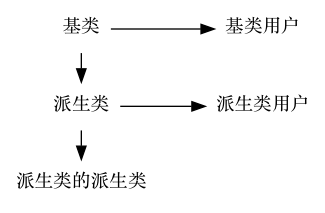

1. **类的成员的访问控制说明符**用于控制**类的使用者**对类中成员的访问权限
2. **派生列表中的访问控制说明符**用于控制**派生类的使用者**对**派生类从基类继承的成员**的访问权限



对应上图，基类中成员的访问控制说明符就是控制派生类与基类的用户对类的访问权限。而派生类定义时使用的**派生列表中的访问控制说明符与派生类对基类成员的访问没有任何关系**，它控制的是派生类的派生类和派生类用户(即派生类的使用者)对基类成员的访问权限

## 类的成员访问权限

| 成员 | 派生类的成员和友元(派生类) | 类的用户 |
|:---:|:---:|:---:|
|public成员 | 可访问 | 可访问 |
|protected成员| **只能访问派生类对象中的基类部分的protected成员** | 不可访问 |
|private成员| 不可访问 | 不可访问 |

如果派生类的成员和友元能直接访问基类对象的protected成员，那么类的用户就可以定义一个继承基类的类，然后通过这个类来获得基类protected成员的访问。从而简单地规避掉protected提供的访问包含，违背基类只希望和派生类分享protected成员，而不想被其他公共访问的初衷了。

```c
struct Base {
public:
    string pub_string = "public string";
protected:
    string pro_string = "protected string";
private:
    string pri_string = "private string";//只有类自己能访问
};

struct Derived : public Base {
public:
    void access_parent_public(const Base &b){
        cout << b.pub_string << endl;
    }
    //不能直接访问基类对象的protected成员
    void access_parent_protected(const Base &b){
        //cout << b.pro_string << endl;
    }
    //派生类只能访问派生类对象中基类部分的protected成员
    void access_protected_in_derived(){
        cout << pro_string << endl;
    }
};
```

## 派生列表中的访问控制说明符

派生列表中的访问控制说明符控制**派生类的使用者(派生类的派生类和派生类的用户)**对**派生类继承自基类成员**的访问权限

* public继承：**遵循其原有的访问权限**
* protected继承：基类中所以public成员在派生类中”相当于“protected的
* private继承：所有成员都无法访问

**对于派生类的派生类(包括成员和友元)**：

| 成员 | public成员 | protected成员 | private成员 |
|:---:|:---:|:---:|:---:|
|public继承 | 可访问 | **只能访问继承到的受保护成员** | 不可访问 |
|protected继承 | **只能访问继承到的public成员** | 不可访问? | 不可访问 |
|private继承 | 不可访问 | 不可访问 | 不可访问 |

**对于派生类的用户**：

| 成员 | public成员 | protected成员 | private成员 |
|:---:|:---:|:---:|:---:|
|public继承 | 可访问 | 不可访问 | 不可访问 |
|protected继承 | 不可访问 | 不可访问 | 不可访问 |
|private继承 | 不可访问 | 不可访问 | 不可访问 |


## (另)派生类向基类转换的可行性

受两个因素影响：

1. 使用该转换的代码
2. 派生类的派生访问说明符

假定D继承自B（B<--D）：

* **对于D的成员及友元**：不论以什么方式继承，都能使用派生类向基类的转换
* **对于D的派生类的成员及友元**：只有当D以public或protected方式继承时能使用
* **对于用户代码**：只有当D以public继承B时，才能使用派生类向基类的转换

>总的来说，对于代码中的某个给定节点来说，如果基类的公用成员是可访问的，则派生类向基类的类型转换也是可访问的